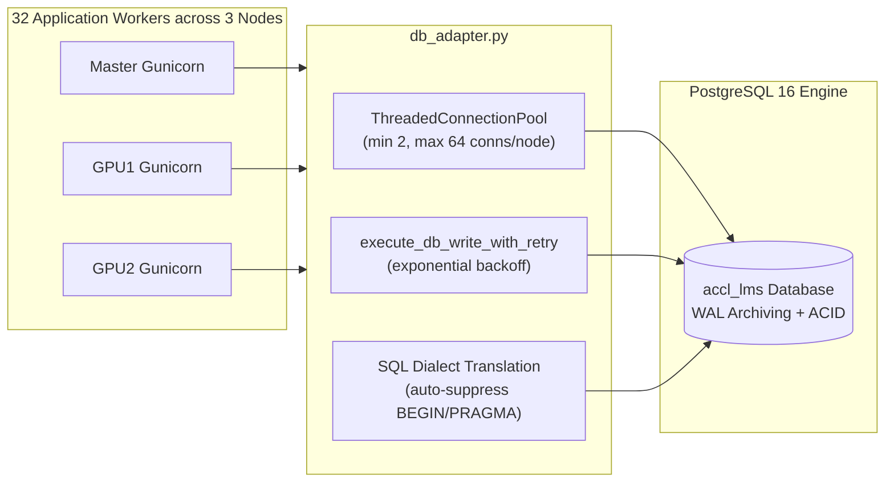

# Hoodle LMS: Multi-Node Distributed Cluster Architecture

**Hoodle LMS** is an enterprise-grade, high-availability, fault-tolerant Learning Management System designed to serve 20,000+ students and faculty across university campus networks and the Internet.

This document details the multi-node distributed cluster topology, load balancing mechanisms, database connection pooling, shared NFS storage, 100% Slurm GPU hardware isolation, automatic failover policies, and disaster recovery procedures.

---

## 1. High-Level Architecture Overview

Hoodle LMS utilizes a decoupled, three-tier distributed architecture spanning three physical servers connected via a dedicated gigabit private network (`192.168.99.0/24`) and campus intranet (`10.10.14.0/24`):

```
                                  [ Students & Faculty ]
                                  (20,000+ Concurrent)
                                      /          \
                       Web Browsers  /            \  Android Native App
                                    /              \
                                   v                v
         ========================================================================
         [ Master Gateway Server: 10.10.14.104 / 192.168.99.2 ]
         ------------------------------------------------------------------------
         • NGINX Reverse Proxy & Layer 7 Load Balancer
         • SSL/TLS Termination + Dynamic Static Asset Cache
         • Active Health Checks + Sub-5s Automatic Failover
         • Master Web Application (8 Gunicorn Workers on CPU)
         ========================================================================
                         |                         |
            (Private 1Gbps / 192.168.99.3) (Private 1Gbps / 192.168.99.4)
                         |                         |
                         v                         v
         +-----------------------------+   +-----------------------------+
         | Worker Node 1: gpu1         |   | Worker Node 2: gpu2         |
         | (192.168.99.3:8095)         |   | (192.168.99.4:8095)         |
         | --------------------------- |   | --------------------------- |
         | • 8 Gunicorn CPU Workers    |   | • 8 Gunicorn CPU Workers    |
         | • Sub-5ms Internal Latency  |   | • Sub-5ms Internal Latency  |
         | • 100% Slurm GPU Isolation  |   | • 100% Slurm GPU Isolation  |
         +-----------------------------+   +-----------------------------+
                         \                         /
                          \                       /
                           v                     v
         ========================================================================
         [ Shared Data & Persistence Tier ]
         ------------------------------------------------------------------------
         • PostgreSQL 16 Enterprise Cluster (127.0.0.1:5432)
           - Thread-Safe Connection Pooling (2-64 conns per node, 192 max total)
           - Automatic write-retry engine on concurrency conflicts
         • Network File System (NFS Mount: /data/admin/ACCLLMS)
           - 15TB Shared Storage: Submissions, Lockers, Course Materials, Static Assets
         • 100% Hardware Slurm GPU Isolation
           - NVIDIA RTX A6000 GPUs (48GB VRAM) dedicated exclusively to AI/ML
           - LMS runs CPU-only (CUDA_VISIBLE_DEVICES=""): 0% GPU interference
         ========================================================================
```

---

## 2. Cluster Topology & Node Specifications

| Node ID | Hostname | Internal IP | Role | Process Model | Worker Capacity |
| :--- | :--- | :--- | :--- | :--- | :--- |
| **Node 0** | `master` | `192.168.99.2` | Master Gateway, Reverse Proxy, PostgreSQL, App Worker | NGINX + Gunicorn + PG16 | 8 CPU Workers |
| **Node 1** | `gpu1` | `192.168.99.3` | Application Worker Node 1 | Gunicorn Systemd Service | 8 CPU Workers |
| **Node 2** | `gpu2` | `192.168.99.4` | Application Worker Node 2 | Gunicorn Systemd Service | 8 CPU Workers |
| **Cluster Total** | — | — | **Distributed Web App Tier** | **3 Nodes in Parallel** | **24+ CPU Workers** |

---

## 3. Load Balancing & Traffic Routing Engine

Traffic arriving at `https://10.10.14.104/lms/` or direct cluster endpoints is handled by NGINX using a weighted round-robin distribution tuned according to node capacity:

```nginx
upstream accl_lms_upstream {
    # Master Gateway Node
    server 127.0.0.1:8096 weight=2 max_fails=2 fail_timeout=5s;

    # Worker Node 1 (gpu1)
    server 192.168.99.3:8095 weight=3 max_fails=2 fail_timeout=5s;

    # Worker Node 2 (gpu2)
    server 192.168.99.4:8095 weight=3 max_fails=2 fail_timeout=5s;

    keepalive 64;
}
```

### High Availability & Automatic Failover Mechanics
1. **Sub-5s Failure Detection**: If a worker node crashes or fails to respond within 5 seconds (`fail_timeout=5s`), NGINX marks it temporarily unhealthy after 2 consecutive failed attempts (`max_fails=2`).
2. **Transparent Rerouting**: Incoming and in-flight HTTP requests are automatically rerouted to the remaining healthy nodes without throwing 502/504 errors to end users:
   ```nginx
   proxy_next_upstream error timeout invalid_header http_500 http_502 http_503 http_504;
   proxy_next_upstream_tries 3;
   proxy_next_upstream_timeout 10s;
   ```
3. **Stateless Session Validation**: User session cookies are cryptographically signed with a cluster-wide secret key. Any node can authenticate and serve any student's request seamlessly.
4. **Self-Healing**: When a failed node recovers, NGINX automatically probes and re-introduces it into the active rotation without requiring service reloads.

---

## 4. Database Architecture & Concurrency Control

### Dual-Engine Database Adapter (`db_adapter.py`)
Hoodle LMS employs an intelligent database abstraction layer that supports high-throughput PostgreSQL for multi-node deployments and SQLite for local development or instant disaster rollback.



### Key Concurrency Features:
- **Threaded Connection Pooling**: Each worker node maintains a thread-safe connection pool (`minconn=2, maxconn=64`), providing up to 192 simultaneous database connections across the cluster.
- **Write-Retry Mechanism**: `execute_db_write_with_retry()` automatically retries transactions on concurrency serialization conflicts with randomized exponential jitter.
- **Zero-Deadlock Schema**: Foreign key indexing, row-level locks, and automatic suppression of SQLite-specific `BEGIN IMMEDIATE` / `PRAGMA` directives prevent syntax errors and connection drops in PostgreSQL mode.

---

## 5. 100% Slurm GPU Hardware Isolation

`gpu1` and `gpu2` host high-performance **NVIDIA RTX A6000 GPUs (48GB VRAM each)** utilized by university researchers for heavy AI/ML and deep learning compute jobs scheduled via **Slurm**.

Hoodle LMS enforces a **100% CPU-only hardware isolation policy**:
1. **Explicit Device Masking**: The systemd service on all nodes explicitly disables GPU driver visibility:
   ```ini
   [Service]
   Environment="CUDA_VISIBLE_DEVICES="
   Environment="NVIDIA_VISIBLE_DEVICES=none"
   ```
2. **Zero Resource Preemption**: Gunicorn web workers and database queries execute exclusively on AMD/Intel host CPU cores and host RAM.
3. **Telemetry Verification**: The live system monitor at `/admin/system` continuously checks compute applications via `nvidia-smi`, verifying `0.0% LMS GPU load` at all times.

---

## 6. Shared Storage & Distributed Assets (NFS)

All cluster nodes mount `/data` via high-throughput Network File System (NFS), ensuring instantaneous synchronization of:
- Student submission attachments (`/data/admin/ACCLLMS/uploads/submissions/`)
- Student digital locker files (`/data/admin/ACCLLMS/uploads/lockers/`)
- Coursework and assignment materials (`/data/admin/ACCLLMS/uploads/coursework/`)
- Android APK downloads (`/data/admin/ACCLLMS/static/hoodle.apk`)

File operations use atomic temporary writes followed by POSIX renames, preventing partial file reads across nodes.

---

## 7. Real-Time Admin Telemetry & Observability

Administrators can monitor the entire cluster in real-time from the web portal at **`/admin/system`** or via API at **`/api/admin/system/status`**:

### Monitored Metrics:
- **Cluster Node Health**: Latency (ms), HTTP response codes, and active worker counts for `master`, `gpu1`, and `gpu2`.
- **Exact Error Reporting**: If any node becomes unreachable or times out, a high-contrast Red container displays the exact error message (e.g. `Connection timed out (1.4s)` or `Connection refused`).
- **PostgreSQL Telemetry**: Query roundtrip latency (typically `< 1ms`), database disk size, and active pool connections.
- **Storage Utilization**: Storage gauges for `/` (OS NVMe) and `/data` (Shared 15TB NFS partition).
- **System Load & Memory**: 1m, 5m, 15m load averages and RAM usage percentages.
- **Slurm GPU Status**: Hardware isolation status badge verifying 0% LMS GPU utilization.

---

## 8. Disaster Recovery & 1-Click Rollback

If hardware maintenance is required on `gpu1` or `gpu2`, or if the cluster needs to revert to single-node operation:

### 1-Click Rollback to Local SQLite Mode:
```bash
# On Master Server:
sudo systemctl stop accl-lms
sudo sed -i 's/DATABASE_BACKEND=postgres/DATABASE_BACKEND=sqlite/' /etc/systemd/system/accl-lms.service
sudo systemctl daemon-reload
sudo systemctl restart accl-lms
```

### Isolating a Single Node for Maintenance:
In `/etc/nginx/conf.d/accl-cluster.conf`, mark the target node as `down`:
```nginx
upstream accl_lms_upstream {
    server 127.0.0.1:8096 weight=2;
    server 192.168.99.3:8095 down;  # Under maintenance
    server 192.168.99.4:8095 weight=3;
}
```
Reload NGINX without dropping connections:
```bash
sudo nginx -s reload
```
