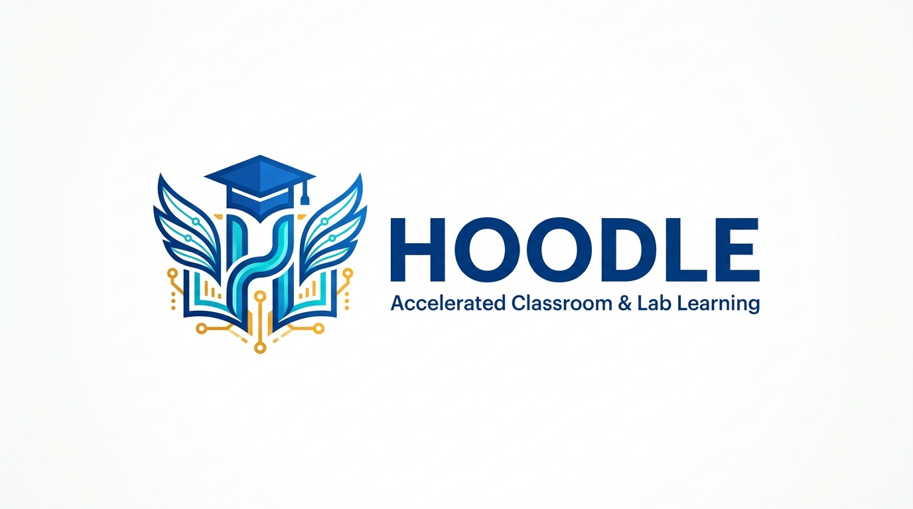

# Hoodle: Accelerated Classroom & Lab Learning Management System

<div align="center">



<br><br>

**Accelerated Classroom & Lab Learning (Hoodle)**  
*Developed by **Kishan Tamboli (PhD)** • **Accelerated Computing Research Lab (ACCL)** • **Indian Institute of Technology Bhilai***

[](https://www.python.org/)
[](https://palletsprojects.com/p/flask/)
[](test_lms.py)
[-blueviolet.svg)](static/images/hoodle_brand_kit.zip)
[](README.md)

</div>

---

## 📖 Overview

**Hoodle** is an enterprise-grade, locally deployable Learning Management System (LMS) specifically architected for university academic instruction, engineering computing laboratories, practical examinations, and continuous assessment.

Combining the simplicity and clarity of **Google Classroom** with the rigorous grading and evaluation capabilities of **Canvas LMS**, Hoodle provides modern, fast, and privacy-preserving education technology tailored for on-premise campus intranets and secure cloud/VPN networks:
- **Comprehensive Course Lifecycle Management**: Creator & Admin exclusive archiving, restoration, and complete 1-click full `.zip` offline course export with student submissions, attendance records, and materials.
- **Multi-Venue Geofencing Anti-Proxy System**: Configurable GPS geofences and radii tailored separately for **Lecture (e.g. LHC)**, **Lab (e.g. ED Building)**, and **Tutorial** venues with covert silent proxy detection.
- **In-Portal Live Camera QR Code Attendance Scanner** with dynamically rotating anti-proxy cryptographic tokens.
- **Flexible Attendance Controls**: 1-click "Mark All Present" for compensatory classes, "Skip / Exclude Session" for holidays/cancelled classes, session-by-session matrix CSV export, and Google Sheets live backup.
- **Curriculum Organization & Topic Reordering**: Up/Down reordering controls (⬆️ / ⬇️) for coursework modules with ascending chronological assignment sequencing.
- **Canvas-Style Weighted Grading Engine** out of 100 with category percentages, Excel/CSV bulk import, and customizable mathematical evaluation formulas.
- **Strict Exam Lockdown Mode** with timed windows, ZIP validation, auto-expiration, live proctor telemetry, and cryptographic submission freezing.
- **Cryptographic Digital Submission Receipts** with SHA-256 verification and scannable QR tokens.
- **Integrated In-App PDF Opener / Reader** for instant zero-download document inspection across course materials, student submissions, and cloud lockers.
- **Isolated Student Private Space ("My Cloud Locker")** with in-browser syntax highlighting and disk quota management.
- **High-Availability Multi-Node Cluster Architecture**: Nginx load balancing across Master, GPU1, and GPU2 nodes over high-speed campus intranet and internet (Tailscale Funnel).
- **Dual Network Access Architecture**: Default campus intranet priority with seamless remote access switching.
- **Granular Multi-Tier Role Governance** (Admin, Primary Faculty, Co-Teacher/TA, Student).

---

## ✨ Core Functionalities & System Modules

### 1. 📚 6-Tab Coursework Environment
Every course in Hoodle provides a Google Classroom-style tab navigation:
- **📢 Stream**: Real-time course announcements with rich text, file attachments (with in-app PDF preview), pinned notices, and threaded discussions.
- **📝 Classwork**: Topic-organized curriculum units with 1-click **Move Up / Move Down (⬆️ / ⬇️)** topic reordering controls, ascending chronological assignment listings, assignment authoring with maximum points, deadlines, allowed file extensions, and reference material distribution.
- **👥 People**: Complete course roster for instructors and co-teachers. Features inline role switching (`Student` $\leftrightarrow$ `Co-Teacher` $\leftrightarrow$ `Faculty`), student invitation via class code, and strict student privacy safeguards (students never see classmates' submission status or counts).
- **📅 Attendance**: Real-time attendance dashboard featuring projector screen mode, multi-venue GPS geofence configuration, student check-in telemetry, audit filter bar, CSV export, and bulk manual marking.
- **📊 Grades**: Gradebook matrix with weighted evaluation out of 100, itemized student scorecards, Excel/CSV grade import, pre-filled template generator, and category weighting controls.
- **💬 Messages**: Course-wide threaded communication and student-teacher discussions.

---

### 2. 📦 Course Lifecycle Management & Archival
Hoodle implements a strict, secure course lifecycle governed exclusively by the course creator (`course.teacher_id == user.id`) or system administrators (`user.role == 'admin'`):

- **📁 Course Archiving & Restoration**:
  - Instructors can archive completed semesters or past cohorts with 1 click.
  - Archived courses enter **Read-Only Mode**: students and teachers can review past materials and grades, but new coursework submissions, grade edits, and attendance check-ins are locked.
  - The dashboard cleanly partitions courses into active and archived sections, keeping the primary workspace organized.
  - Courses can be instantly unarchived (restored to active status) at any time.
- **🗑️ Permanent Course Deletion with Cascading Cleanup**:
  - Course creators or administrators can permanently delete courses when necessary.
  - Automatically executes cascaded database purges across: `submissions`, `coursework_attachments`, `coursework`, `comments`, `announcements`, `attendance_logs`, `attendance_sessions`, `attendance_excluded_sessions`, `course_enrollments`, `course_invitations`, `topics`, and `courses`.
  - Safely deletes physical submitted files, coursework attachments, and stream uploads from the server disk.
- **📦 Full Course ZIP Package Export**:
  - Course creators or administrators can export a complete, self-contained offline archive package (`.zip`) containing:
    - `manifest.json`: Machine-readable metadata (course code, title, section, instructor, export timestamps, counts).
    - `course_summary.txt`: Formatted human-readable syllabus, enrollment, and coursework summary.
    - `students_roster.csv`: Complete student directory with IDs, roll numbers, names, usernames, emails, enrolled dates, and attended session counts.
    - `attendance/`:
      - `attendance_matrix.csv`: Full student-by-session matrix.
      - `raw_attendance_logs.csv`: Every individual check-in timestamp, IP address, method, and status.
      - `excluded_sessions.csv`: List of cancelled or skipped classes with dates and reasons.
    - `coursework/`:
      - `coursework_overview.csv`: Master catalog of all assignments, quizzes, and exams.
      - Per-assignment folders containing `details.txt`, teacher reference attachments, `submissions_summary.csv`, and all submitted student solution files neatly organized by roll number.
    - `stream/`:
      - `announcements.csv` and `comments.csv` along with all stream uploaded materials.

---

### 3. 📷 In-Portal Live Camera QR Attendance Scanner & Projector
- **Classroom Projector Screen (`/courses/<id>/attendance/projector`)**:
  - Fullscreen display tailored for lecture halls and lab projectors.
  - Generates SVG QR codes using rotating cryptographic tokens.
  - **1-Second Live Polling Stream**: Automatically displays attending students as they scan in real time with audio-visual check-in feedback.
- **In-Portal Camera Scanner (`#qrScannerModal`)**:
  - Embedded HTML5 camera viewfinder opening directly from any page.
  - Auto-selects the environment (rear) camera on mobile devices with an instant **🔄 Flip Camera** toggle.
  - **Android & iOS Camera Permission Guides**: Modal guidance tabs for Chrome (Android) and Safari (iOS) if permissions were previously blocked.
  - **Instant Phone Camera Fallback**: Allows students to snap a quick photo using their native camera app, scanning the QR code client-side without requiring WebRTC video streaming permissions.
- **Anti-Fraud Dynamic Rotation**:
  - Tokens rotate dynamically based on timestamped HMAC secrets. Screenshots shared over chat expire within seconds, preventing proxy attendance.

---

### 4. 📍 Multi-Venue Geofencing & Silent Anti-Proxy Telemetry
Hoodle features multi-venue location validation tailored for university campuses where lectures, practical labs, and tutorials occur in distinct buildings:
- **Multi-Venue GPS Geofencing**:
  - Configure distinct latitude, longitude, and allowed radiuses (default 100m) for **🏛️ Lecture Hall (e.g. LHC)**, **🔬 Practical Lab (e.g. ED Building)**, and **📖 Tutorial Rooms**.
  - **Auto-Detect GPS ("📡 Use My Location")**: Instantly captures high-accuracy browser coordinates when sitting in the respective classroom or lab.
  - Independent enable toggles per session type.
- **Covert Silent Anti-Proxy Detection**:
  - When students submit attendance, their GPS coordinates are mathematically validated against the active session's venue using the Haversine spherical distance formula.
  - Off-site submissions are **silently flagged** (`is_proxy_suspect = 1`) with an audit remark (e.g., `Outside Lab (ED Building Lab 320) Geofence: 452m away (Allowed: 100m)`).
  - **Zero Student Alert**: Students see a standard check-in confirmation to prevent them from discovering geofence boundaries or circumventing checks.
  - Instructors and TAs see prominent **⚠️ Proxy Suspect** badges highlighted in bold red across recent logs and student history.
- **Dual Device / IP Sharing Detection**:
  - If multiple student accounts submit attendance from the identical IP/device within the same class session, both records are automatically cross-flagged on teacher rosters.

---

### 5. 📅 Flexible Attendance Management Controls
- **✅ Mark All Students Present**:
  - Instructors can grant full attendance (marking all enrolled students as PRESENT) for any selected date and session type (`Lecture`, `Lab`, `Tutorial`).
  - Ideal for holidays, college events, compensatory lectures, or guest seminars.
- **🚫 Skip / Exclude Session**:
  - Instructors can exclude specific dates and session types from total session calculations (e.g. cancelled classes, university holidays, technical lab downtime).
  - Automatically omits the session from total session counts and percentage calculations without destroying attendance audit history.
  - Excluded sessions can be re-included into attendance counting with 1 click.
- **📊 Detailed Session-by-Session CSV Export**:
  - Comprehensive matrix export mapping every student against every individual lecture and lab session date.
- **🌐 Google Sheets Live Backup Integration**:
  - Connect Google Sheets via Apps Script webhook (`doPost(e)`) or `=IMPORTDATA(...)` formula for automated off-site attendance mirroring.

---

### 5. ⚖️ Weighted Assessment Engine & Gradebook
- **Final Marks Out of 100**:
  - Instructors configure category weight percentages (e.g. End-Sem: 20%, Mid-Sem: 20%, Lab Assessments: 45%, Lab Exam: 10%, Live Attendance: 5%).
  - Automatically factors in live attendance percentages calculated from dynamic QR scans.
- **Custom Mathematical Formula Support**:
  - Optional formula engine allowing custom expressions (e.g. `0.20*EndSemesterExam + 0.10*LabExams + 0.05*Attendance`).
- **Student Personal Scorecard**:
  - Displays **Weighted Total (Out of 100)** and running score without confusing letter grades.
  - Prioritizes itemized coursework breakdown first, placing category weight reference down below.
- **Bulk Spreadsheet Import & Export**:
  - Upload grades via **Excel (`.xlsx`)**, **CSV**, or **TSV** exported from Google Sheets or Excel.
  - Auto-matches student rows by Roll Number, Username, or Email, and columns by coursework title.
  - 1-click **Download Pre-Filled Course Template (`.csv`)** with enrolled students already populated.

---

### 6. 🔒 Strict Exam Lockdown Mode
- **Zero-Resource Lockdown**:
  - When enabled, students entering the course are strictly locked out of lecture materials, stream announcements, and their private cloud locker.
  - Students are automatically redirected to the dedicated Exam Portal.
- **Strict ZIP Archive Validation**:
  - Enforces `.zip` file submissions with magic-byte header inspection (`PK\x03\x04`).
- **Auto-Expiration & Cryptographic Lockout**:
  - Real-time countdown timer synchronized with server time.
  - Lockdown automatically lifts when the exam end time passes.
  - Submissions are permanently locked; students cannot unsubmit or overwrite work once the exam concludes.
- **Live 1-Second Exam Submissions Telemetry Monitor (`/api/.../live-submissions`)**:
  - Real-time proctor dashboard for instructors and TAs with automated 1-second background polling.
  - Live metric cards: **Total Submissions** (with enrolled progress bar), **On-Time Submissions** (`✓ On-Time`), **Late Submissions**, and **Pending/Assigned**.
  - Dynamic roster table highlighting newly arrived student submissions in real time with green pulse animations.

---

### 7. 📜 Cryptographic Digital Submission Receipts
- Every assignment and exam submission generates an immutable digital receipt.
- Contains student roll number, lab venue, submission timestamp, version count, and a **SHA-256 cryptographic checksum**.
- Includes a verifiable digital receipt URL and scannable QR verification code.

---

### 8. 📕 Integrated In-App PDF Opener / Reader
- **Zero-Download Document Inspection**:
  - High-performance embedded PDF reader modal (`#pdfViewerModal`) accessible across the entire LMS.
  - Features a clean toolbar with **⛶ Fullscreen toggle**, **↗ Open in New Tab**, **⬇ Download File**, and **✕ Close** (also supports `Escape` key).
- **Available Across All Workflows**:
  - **Coursework Reference Files**: Teachers attach PDFs; students view them directly in-app.
  - **Teacher Submissions Roster**: Instructors can click **👁 View PDF** on student submissions to grade lab reports immediately without downloading files to disk.
  - **Student "Your Work"**: Students can inspect their submitted PDF solution directly.
  - **Stream Announcements**: In-app reading for PDF notices.
  - **Student Locker**: Previewing any locker `.pdf` file opens the in-app PDF reader.

---

### 9. 🗄️ Student Cloud Locker ("My Private Space")
- Every student has an isolated private workspace on the server (`storage/lockers/<user_id>/`).
- Upload code files (`.c`, `.cpp`, `.cu`, `.py`, `.sh`, `.txt`, `.md`, `.pdf`, `.json`, `.sql`).
- In-browser code preview with line numbers and syntax styling.
- 1-click **Attach from Locker** when submitting coursework assignments.
- Storage quota meter (default 500 MB) with 1-click whole-locker `.zip` backup download.

---

### 10. 🌐 Dual Network Architecture & Intranet Priority
Hoodle is engineered with a dual network architecture supporting simultaneous campus intranet and secure internet access:
- **Campus Intranet (Default & High Priority)**:
  - Accessible via campus LAN IP (e.g. `http://10.10.14.104:8095` or `https://10.10.14.104/lms/`).
  - High-bandwidth, zero external data consumption, and minimal latency for high-concurrency exam submissions.
- **Internet / Remote Access**:
  - Accessible securely via Tailscale VPN or institutional domain (e.g. `https://accllogin.tail77fd8b.ts.net/lms/`).
- **Network Access Mode Selector**:
  - Centered bottom selector on the login screen and within the user menu allowing students and faculty to switch network access domains seamlessly without displaying raw URLs.

---

### 11. 🛡️ Role-Based Access Control (RBAC)
| Role | Permissions & Capabilities |
| :--- | :--- |
| **Administrator (`admin`)** | Full system directory (`/admin/users`), password resets, role assignment, user creation/deletion, system storage auditing, course archive/delete/export. |
| **Faculty / Instructor (`teacher`)** | Create and manage courses, author coursework, grade submissions, configure weights, export gradebooks, manage class rosters, archive/delete own courses, full course export. |
| **Co-Teacher / TA (`ta`)** | Course-level teaching privileges: grade coursework, inspect submissions, view and manage attendance logs. Cannot delete or archive courses. |
| **Student (`student`)** | Join courses with 6-character class codes, view personal grades and weighted total out of 100, scan attendance QR codes, turn in work, access personal locker. Classmate submission privacy is strictly preserved. |

---

### 12. 🎨 Official Brand Identity & Downloadable Logo Kit
- **Official Visual Identity Portal (`/brand`)**:
  - Dedicated brand page providing direct 1-click downloads for instructors, students, developers, and event organizers.
  - **Scalable Vector Logo (`hoodle_logo.svg`)**: Infinite-resolution brand lockup with typography and ACCL lab credentials for print, posters, and web.
  - **High-Resolution Raster Emblem (`hoodle_logo.png`)**: 1024×1024 px academic mortarboard, stylized 'H', open book wings, and neural computing network nodes.
  - **Horizontal Presentation Banner (`hoodle_banner.png`)**: 16:9 HD banner for presentations, publications, slide decks, and GitHub repositories.
  - **Dark Squircle App Icon (`hoodle_app_icon.png` & `hoodle_mark.svg`)**: Mobile homescreen icon, PWA badge, and web favicon.
  - **Downloadable Brand Kit (`/brand/download/kit`)**: Bundled `.zip` archive containing all SVG, PNG, and partner logos (ACCL Lab, IIT Bhilai) along with official color specifications (`#1D4ED8`, `#06B6D4`, `#F59E0B`, `#0F172A`).

---

## 🏗️ Multi-Node Cluster Architecture & Technology Stack

```
                             [ Client Browser / Mobile App ]
                                            │
                     ┌──────────────────────┴──────────────────────┐
                     ▼                                             ▼
          [ Campus Intranet (LAN) ]                     [ Internet / Remote ]
            10.10.14.104:443 / 8095                      accllogin.tail77fd8b.ts.net
                     │                                             │
                     └──────────────────────┬──────────────────────┘
                                            │
                                HTTPS / Port 443 / 8095
                                            ▼
                           [ Nginx Reverse Proxy & Load Balancer ]
                                            │ (least_conn upstream)
                     ┌──────────────────────┼──────────────────────┐
                     ▼                      ▼                      ▼
           [ Master Node:8096 ]       [ GPU1 Node:8095 ]     [ GPU2 Node:8095 ]
           (Gunicorn 8w • 32t)        (Gunicorn 8w • 32t)    (Gunicorn 8w • 32t)
                     │                      │                      │
                     └──────────────────────┼──────────────────────┘
                                            ▼
                              [ Distributed Services Layer ]
                     ┌──────────────────────┼──────────────────────┐
                     ▼                      ▼                      ▼
        [ Central PostgreSQL DB ]     [ Shared NFS Cluster ]  [ HPC Module Environment ]
        • accl_lms Database           • /data/admin/ACCLLMS/  • /apps/modules/
        • Connection Pooling          • storage/lockers/      • module load gcc
        • SQLite3 Engine Fallback     • storage/submissions/  • master, gpu1-2, skylus1-4
```

- **Clustered Backend**: Distributed Gunicorn 21.2 (`gthread` worker class) running across 3 physical/GPU cluster nodes with automatic health monitoring and dynamic failover (`proxy_next_upstream`).
- **Load Balancer**: Nginx with `least_conn` distribution, SSL termination (TLS 1.2/1.3), static file caching, and streaming reverse-proxying.
- **Database Layer**: Production PostgreSQL backend (`accl_lms`) supporting high-concurrency attendance bursts with atomic transactions and serialization retries, with full embedded SQLite3 support.
- **Shared Storage**: Clustered NFS storage mount (`/data/admin/ACCLLMS`) ensuring instantaneous synchronization of uploads, submissions, attachments, and logs across nodes.
- **HPC Environment Integration**: Integrated Environment Modules across all compute nodes (`module load gcc` available on master, gpu1, gpu2, skylus1, skylus2, skylus3, skylus4).
- **Frontend**: Responsive HTML5, CSS Variables, Flexbox/Grid, Vanilla JavaScript (zero heavy client-side frameworks).
- **Barcode & QR Engine**: `html5-qrcode` (client-side video stream), `qrcode[pil]` (server-side dynamic HMAC token generation).
- **Spreadsheet Processing**: `openpyxl` (Excel `.xlsx`), standard Python `csv` engine.

---

## 🚀 Fresh Installation & System Setup Guide

### Method 1: Automated 1-Command Setup (Recommended)

Run the included interactive setup script on Ubuntu 22.04 LTS or Debian:

```bash
git clone https://github.com/KishantLab/Hoodle.git
cd Hoodle
chmod +x setup.sh
sudo ./setup.sh
```

The automated installer will:
1. Detect server network IPs and prompt for installation directory and service parameters.
2. Install all required OS packages (`python3`, `python3-pip`, `python3-venv`, `python3-dev`, `sqlite3`, `nginx`, `curl`, `git`, `rsync`, `ufw`).
3. Set up the Python virtual environment and install dependencies from `requirements.txt`.
4. Initialize the SQLite database schema and seed default administrative and faculty accounts.
5. Create isolated storage directories (`storage/lockers`, `storage/submissions`, `storage/attachments`, `storage/exports`) with proper read/write permissions.
6. Run the complete automated test suite to verify 100% system health.
7. Configure and start the systemd service (`accl-lms.service`) with multi-threaded Gunicorn workers.
8. Configure Nginx reverse proxy with HTTPS camera streaming headers and 500MB upload limits.

---

### Method 2: Manual Installation Step-by-Step

#### 1. Install System Dependencies & Build Tools
```bash
sudo apt-get update
sudo apt-get install -y \
    python3 \
    python3-pip \
    python3-venv \
    python3-dev \
    build-essential \
    sqlite3 \
    nginx \
    curl \
    git \
    rsync
```

#### 2. Clone the Repository & Configure Python Environment
```bash
# Clone repository
sudo git clone https://github.com/KishantLab/Hoodle.git /data/admin/ACCLLMS
cd /data/admin/ACCLLMS

# Create and activate virtual environment
python3 -m venv venv
source venv/bin/activate

# Upgrade pip and install application dependencies
pip install --upgrade pip
pip install -r requirements.txt
```

#### 3. Create Storage Directories & Set Permissions
```bash
mkdir -p storage/lockers storage/submissions storage/attachments storage/exports
sudo chown -R www-data:www-data /data/admin/ACCLLMS
sudo chmod -R 775 storage
```

#### 4. Initialize Database Schema & Pre-Seeded Accounts
```bash
source venv/bin/activate
python3 -c "import app; app.init_db(); print('Database schema and initial accounts verified.')"
```

#### 5. Run Verification Tests
```bash
source venv/bin/activate
python3 -m unittest -v test_lms.py
```

#### 6. Configure Systemd Service
Create `/etc/systemd/system/accl-lms.service`:
```ini
[Unit]
Description=ACCL Learning Management System & Classroom Portal (Hoodle)
After=network.target

[Service]
User=www-data
Group=www-data
WorkingDirectory=/data/admin/ACCLLMS
Environment="PATH=/data/admin/ACCLLMS/venv/bin:/usr/local/bin:/usr/bin:/bin"
ExecStart=/data/admin/ACCLLMS/venv/bin/gunicorn --workers 16 --threads 4 --worker-class gthread --bind 0.0.0.0:8095 --timeout 120 --keep-alive 5 --max-requests 2000 --max-requests-jitter 200 app:app
Restart=always
RestartSec=3
KillMode=mixed
TimeoutStopSec=30
LimitNOFILE=65535

[Install]
WantedBy=multi-user.target
```

Enable and start the service:
```bash
sudo systemctl daemon-reload
sudo systemctl enable accl-lms.service
sudo systemctl start accl-lms.service
sudo systemctl status accl-lms.service
```

#### 7. Configure Nginx Reverse Proxy (with HTTPS & Camera Headers)
Add the following block to your Nginx configuration (e.g. `/etc/nginx/sites-available/default`):

```nginx
# Redirect bare prefix to trailing slash
location = /lms {
    return 301 /lms/;
}

# Hoodle LMS Application Proxy
location /lms/ {
    proxy_pass http://127.0.0.1:8095/;
    proxy_http_version 1.1;
    proxy_set_header Upgrade $http_upgrade;
    proxy_set_header Connection "upgrade";
    proxy_set_header Host $host;
    proxy_set_header X-Real-IP $remote_addr;
    proxy_set_header X-Forwarded-For $proxy_add_x_forwarded_for;
    proxy_set_header X-Forwarded-Proto $scheme;
    client_max_body_size 500M;
    proxy_read_timeout 300s;
    proxy_send_timeout 300s;
}
```

Test and reload Nginx:
```bash
sudo nginx -t
sudo systemctl reload nginx
```

---

## 👤 Pre-Seeded Default Accounts

| Account Role | Username / Roll | Default Password | Notes |
| :--- | :--- | :--- | :--- |
| **System Administrator** | `admin` | `admin@accl` | Global management, user directory, system configuration |
| **Primary Faculty** | `kishan` | `password123` | Course author, instructor controls, gradebook |
| **Student Account** | `student1` | `student123` | Roll No: `B26DS001` (Aarav Sharma) |

> [!IMPORTANT]
> Change the default administrator and faculty passwords immediately upon initial server deployment via `/change-password`.

---

## 🛠️ Operational Commands & Server Maintenance

```bash
# Check service status
sudo systemctl status accl-lms.service

# Restart application service after updates
sudo systemctl restart accl-lms.service

# View live application logs
sudo journalctl -u accl-lms.service -f

# Test Nginx configuration
sudo nginx -t

# Run automated test suite
source venv/bin/activate && python3 -m unittest -v test_lms.py

# Quick SQLite database backup
sqlite3 accl_lms.db ".backup 'accl_lms_backup_$(date +%Y%m%d_%H%M%S).db'"
```

---

## 🧪 Automated Testing Suite

Hoodle includes 73 comprehensive integration and unit tests covering every subsystem:
```bash
python3 -m unittest -v test_lms.py
```

### Verified Test Categories
- **Authentication & Security**: Registration, password hashing, session expiration, roll number capitalization, duplicate roll protection.
- **Role Governance**: Admin directory, role promotions, faculty assignment, student privacy boundaries.
- **Course Lifecycle**: Course creation, archiving, restoring, full ZIP package export verification, permanent deletion cascades across 12+ tables.
- **Attendance Engine**: Rotating dynamic HMAC QR codes, projector 1-second polling, camera permissions, "Mark All Present", "Skip / Exclude Session", session matrix CSV, Google Sheet webhook sync.
- **Grading & Assessment**: Canvas-style category weight formulas out of 100, live attendance weighting, Excel/CSV bulk import/export.
- **Exam Lockdown**: Zero-resource redirection, magic-byte `.zip` enforcement, server-synchronized auto-expiration, cryptographic submission freeze, live proctor telemetry.
- **Student Cloud Locker**: Quota meters, code preview, locker whole-archive download.
- **PDF Viewer & UI**: Embedded zero-download reader, centered mobile top bar, dual network access switcher.

---

## 📄 License & Credits

Developed by:  
**Kishan Tamboli (PhD)**  
*Accelerated Computing Research Lab (ACCL)*  
*Department of Computer Science & Engineering*  
*Indian Institute of Technology Bhilai (IIT Bhilai), India*  

*Accelerated Classroom & Lab Learning • ACCL IIT Bhilai*
